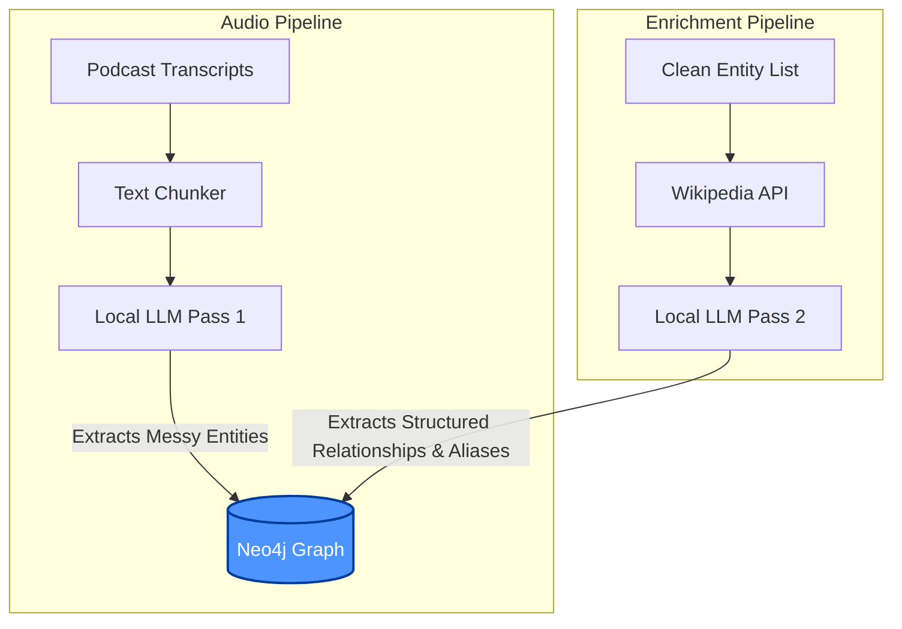

# Weird Little People: Iteration 2 - Scaling the LLM Extraction Pipeline

After successfully proving out the core concept in the initial prototype—using a local LLM to extract entities and relationships from podcast transcripts into a Neo4j graph database—it was time to refactor. The prototype worked, but as the dataset grew, the monolithic script quickly became a bottleneck. 

Iteration 2 focused on transforming that prototype into a robust, object-oriented data pipeline, optimizing for execution speed, compute cost, and observability. 

Here is a breakdown of the architectural shifts, the hurdles encountered, and where the project is heading next.

---

## Architectural Shifts: From Script to System

The original prototype did everything in a single pass, hitting the database constantly. For Iteration 2, the codebase was restructured into a cleaner MVC-style architecture (`controllers`, `services`, `models`, `views/cli`). 

### 1. The Two-Pass Extraction Toggle
Running full relationship extraction on every text chunk was computationally heavy. By refactoring the pipeline to separate Entity Extraction (Pass 1) from Relationship Extraction (Pass 2), I added a CLI toggle (`--relationships`). 

This allows for rapid passes over the data to validate entity extraction quality before committing to the more expensive relationship mapping.

### 2. In-Memory Deduplication (Stateful Pipeline)
Relying on Neo4j's `MERGE` constraints for deduplication meant a database roundtrip for every single entity and relationship the LLM found. 

**The Fix:** When the pipeline boots up, it now executes a single read transaction to pull all existing Entity IDs and Relationship Tuples `(source, type, target)` from Neo4j into Python `set()` structures. 
As the LLM parses chunks, lookups happen in memory ($O(1)$ time). Only truly novel data triggers a database write, drastically reducing network overhead and speeding up batch processing.

### 3. Contextual Observability
To actually measure the impact of these changes, the pipeline needed better logging. Instead of writing messy `time.time()` math everywhere, I implemented a reusable Context Manager.

```python
# src/utils/timer.py
class Timer:
    def __init__(self, task_name, log_file="logs/pipeline.log"):
        self.task_name = task_name
        self.log_file = Path(log_file)

    def __enter__(self):
        self.start_time = time.time()
        return self

    def __exit__(self, exc_type, exc_val, exc_tb):
        elapsed = time.time() - self.start_time
        # Formats time and appends to the same log file as Cypher queries
```
Using `with Timer("Chunk 1"):` seamlessly interleaves execution times with Cypher logs, creating a perfect audit trail.

---

## Roadblocks & Resolutions

No data pipeline survives contact with raw data unscathed. Here are the main issues we ironed out in this iteration.

### Issue 1: Pydantic Panics on LLM Hallucinations
**The Problem:** Smaller local LLMs occasionally drop keys or return `null` when confused. When the LLM returned `null` for a `sub_label`, Pydantic threw a strict validation error, causing the pipeline to drop the entire chunk of data.

**The Solution:** Implemented defensive programming using Pydantic's `@model_validator(mode="before")`. Pydantic intercepts the raw JSON before strict validation, safely patching `null` values and formatting IDs.

```python
@model_validator(mode="before")
@classmethod
def sanitize_llm_data(cls, data):
    if isinstance(data, dict):
        # Enforce snake_case for IDs
        if data.get("id"):
            data["id"] = data["id"].replace(" ", "_").lower()
            
        # Auto-generate name if the LLM dropped it
        if not data.get("name") and data.get("id"):
            data["name"] = data["id"].replace("_", " ").title()

        # Fallback for missing/null sub_labels to prevent DB crashes
        if not data.get("sub_label"):
            data["sub_label"] = "Uncategorized"
    return data
```

### Issue 2: The Timestamp Trap
**The Problem:** The `TextChunker` was returning `[00:00]` for every single chunk. The regex was too rigid (expecting strictly `[00:00]`), and the state-tracking logic was updating the timestamp *before* checking if a chunk limit was exceeded, causing timestamps to leak backwards into previous chunks.

**The Solution:** Rewrote the chunker's state logic to track both `chunk_start_timestamp` and `active_timestamp`, and relaxed the regex `r'[\[\(]?(\d{1,2}:\d{2}(?::\d{2})?)[\]\)]?'` to handle varied formats like `(01:23)` or raw `12:34`. The Context Anchor passed to the LLM is now perfectly synchronized with the transcript.

---

## Looking Forward: Iteration 3

While Iteration 2 stabilized the infrastructure, the data itself revealed a new challenge: **Coreference Resolution.** 

The narrative structure of podcasts means people are referred to inconsistently (first name + surname, just first name, nicknames). A local LLM struggles to accurately map these variations across different chunks, making relationship extraction incredibly noisy.

### The Dual-Source Architecture
To solve this, Iteration 3 will pivot away from relying solely on the transcripts for relationships. Instead, the podcast will serve as the **structural roadmap**, while **Wikipedia** will serve as the ground-truth data enricher.



By querying the `wikipedia-api`, grabbing high-signal sections (like "Early Life" or "Career"), and parsing them with strict Pydantic schemas, we can establish canonical Node IDs (e.g., `John_Smith_(actor)`). 

The messy podcast references can then be stored as an `aliases` array on the canonical node, cleanly anchoring the graph and eliminating duplicates.

Onward to the integration!
